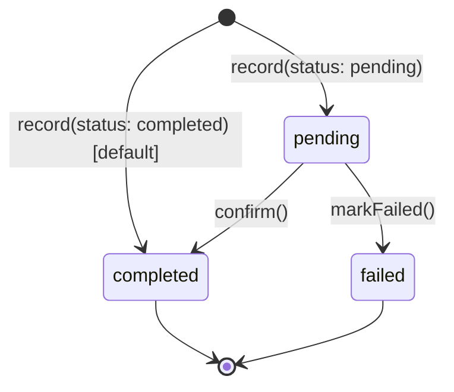

# Transaction lifecycle

## States

A transaction has exactly one status at any time, stored via
`transaction_status_id` and exposed through `isPending()`, `isCompleted()`,
`isFailed()` on `StoreWalletTransaction`.

| Status | Meaning | Affects wallet balance? |
|---|---|---|
| `pending` | Recorded, but not yet applied to the balance. Awaiting an external outcome (e.g. a PSP webhook). | No |
| `completed` | Applied to the balance. Terminal for a normal transaction. | Yes |
| `failed` | A `pending` transaction that did not go through. | No |

Two further statuses are seeded ([TransactionStatusSeeder](../../database/seeders/TransactionStatusSeeder.php))
and exposed on the model (`isReversed()`, `isCancelled()`), but are **not
currently assigned by `WalletTransactionService`**:

- `reversed` — no code path sets this. A transaction being reversed is
  represented differently; see [Reversal is not a status](#reversal-is-not-a-status) below.
- `cancelled` — no code path sets this today.

Treat these two as reserved, not as documented behavior. If you add a code
path that assigns them, update this document and give it its own test file
first.

## State diagram

Notes:

- `record()` defaults to `completed` when no `status` option is given —
  most system-originated transactions (manual credits, computed
  commissions) go straight to `completed`. Only transactions whose outcome
  depends on an external system (PSP webhook, etc.) should be recorded
  `pending`.
- There is no transition back from `completed` or `failed` to `pending`,
  and none from `failed` to `completed`. Both are terminal.
  (`WalletTransactionServiceConfirmTest`: *"throws an exception when
  confirming a non-pending transaction"*, covering both `completed` and
  `failed`.)
- The only other status accepted by `record()`/`reverse()` is whatever
  `TransactionStatus::bySlugOrFail` resolves — an unknown slug throws and
  leaves the wallet untouched (`WalletTransactionServiceRecordTest`:
  *"throws when using an unknown transaction status without mutating
  wallet"*).

## Reversal is not a status

A reversal does **not** move a transaction into a `reversed` state. It
creates a **new, independent transaction** with:

- the opposite economic effect of the original (same amount, but the
  reversal's category determines its own direction — e.g. a `sale`
  (credit) is reversed via `customer_refund`, a debit category),
- `related_transaction_id` pointing back at the original,
- its own status lifecycle (it can itself be `pending` → `completed`, e.g.
  a refund awaiting PSP confirmation).

The original transaction is left completely unchanged — same status, same
`balance_after`, same payload
(`WalletTransactionServiceReverseTest`: *"preserves all original
transaction fields when creating a reversal"*).

"Has this transaction been reversed?" is answered by
`childTransactions()->exists()`, not by the original's own status. A
transaction can only ever acquire one reversal — attempting a second one
throws `TransactionAlreadyReversedException`
(`WalletTransactionServiceReverseTest`: *"does not allow the same
transaction to be reversed twice"*, *"does not allow two different
reversal references for the same transaction"*).

A reversal cannot itself be reversed (`CannotReverseReversalException`,
*"cannot reverse a reversal transaction"*), and only a `completed`
transaction can be reversed (`TransactionNotCompletedException`,
*"throws when reversing a pending transaction"*).

## Direction vs. status

These are independent axes and are easy to conflate:

- **Direction** (`credit`/`debit`) is a fixed property of the transaction's
  *category*, decided once in the category seeder and never changed per
  transaction. It determines whether an amount adds to or subtracts from
  the balance.
- **Status** (`pending`/`completed`/`failed`) is the transaction's own
  lifecycle position, independent of direction. A debit can be `pending`
  just as easily as a credit.

## Operations that drive transitions

See [operations.md](operations.md) for the full contract of each. Summary:

| Operation | Valid starting state | Resulting state |
|---|---|---|
| `record()` | — (creates) | `pending` or `completed`, per `status` option |
| `confirm()` | `pending` | `completed` |
| `markFailed()` | `pending` | `failed` |
| `reverse()` | `completed` (original) | creates a new transaction, itself `pending` or `completed` |
